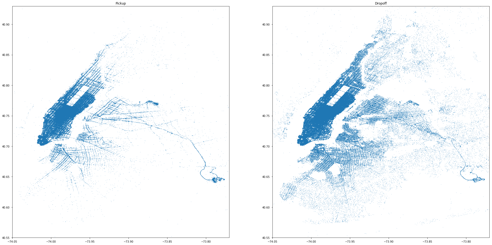
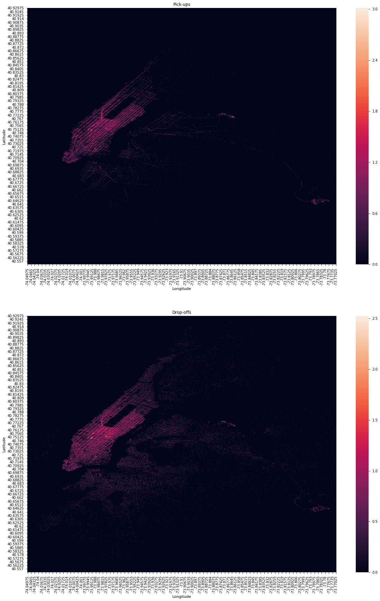

# New York City Taxy Duration Competition

This project refers to [this kaggle competition](https://www.kaggle.com/c/nyc-taxi-trip-duration), and was developed as part of the interview for the Data Scientist position at the [LatAm Experian DataLab](http://www.experian.com/big-data/datalabs.html), in early April 2018. It was my first job.

While kaggle competitions have the central objective of minimizing the error in the testing set, the current project also aimed to show some thinking and visualization skills. 

The discussions through the notebooks have been originally written in portuguese, and are left this way for historical reasons. Most work thereafter have been written in english, like the present readme.

